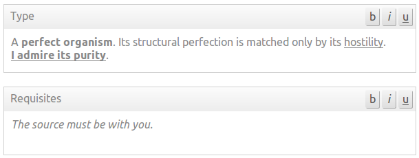

# Simple Editor

A really simple WYSIWYG editor that adds bold, italic and underline
capabilities to textareas.

This editor is intentionally simple and was born from a need I had at work.
Perhaps we may add something else to it in the future, but it is intended to
remain very small and with just a minimal set of features. There are several
other editors that offer everything else you may need.

Here's a screenshot:



We have a version that makes use of jQuery, and one that works without any
external library. If you want to tweak the editor in some way to suit your
particular needs, the jQuery version is probably easier to change. The pure
JavaScript version seems to run faster, though, as expected.

The API is exactly the same for both. Currently, we just expose the methods
`save` and `init`.


## Getting Started

You will need one ore more `textarea`s, each enclosed by a container (`div`, `p`,
etc.) with the class named `fields`. Something like this:


```html
<div class='fields'>
    <label for='requisites'>Requisites</label>
    <textarea id='requisites' name='requisites'></textarea>
</div>
<div class='fields'>
    <label for='description'>Description</label>
    <textarea id='description' name='description'></textarea>
</div>
```

### jQuery Version

Then include jQuery and Simple Editor:

```html
<script type='text/javascript' src='//code.jquery.com/jquery-2.2.2.min.js'></script>
<script type='text/javascript' src='src/simple-editor.js'></script>
```

### Pure JavaScript Version

```html
<script type='text/javascript' src='src/simple-editor-purejs.js'></script>
```


Finally, you tell it to transform textareas in rich (yet simple) editors:

```javascript
simpleEditor.init({
    selector: 'form .fields textarea'
});
```

`selector` can be any valid jQuery selector, such as `#myform .foo textarea`
or simply `textarea`.


## Preparing for form submission to the server

Before submitting, we have to get the text from the editable containers
and copy them to their respective textareas so the browser sends stuff
properly to the server. This is useful even if you are sending data through
ajax, since you can still just grab form data from the `textarea`s themselves
instead of having to find text inside the editor(s). That is easy enough:

```javascript
document.querySelector('#myform').addEventListener('submit', function () {
    simpleEditor.save();
    // Other code to handle form submission...
}, false);
```

## Paste as plain text

By default, when you paste text from libreoffice, msword, google docs or other
rich text editors into a web page editor, the formatting from the original source
is retained in the pasted text. Still, sometimes one needs to paste as clean text
(text/plain). Simple Editor has this feature built in. You just need to enable it:

```javascript
simpleEditor.init({
    selector: 'form .fields textarea',
    pastePlain: true
});
```


